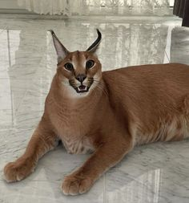

# Тестовое задание на позицию Front-end разработчика

## Для запуска выполните команды:

- git clone https://github.com/Serpentarius13/vue-testovoe
- yarn
- yarn serve

### Проект представляет из себя простое двухстраничное SPA приложение с навигацией

#### Основной функционал:

- Боковое меню с полностью переиспользуемыми кнопками. За них отвечает компонент **BaseSidebarButton**. В props компонента необходимо указать текст и ссылку на картинку в public папке.
- Просмотр постов с фейкового API. Текст поста скрыт изначально и появляется при нажатии на название поста. Посты можно удалять, кнопка оснащена подтверждением, после чего отправляется DELETE запрос на сервер.
- Форма для создания собственного поста. Форма сделана через полу-переиспользуемые компоненты, также есть небольшая самодельная валидация без вывода сообщения об ошибке на экран (вместо него пока alert)

##### Что было использовано при создании:

- Vue CLI и Vue-router c lazy-loading'ом страницы с постами
- Vue Composition API в Single File Components (SFC)
- SCSS для стилей c частичной BEM имплементацией (экстерминировать эту гадость в scoped стилях позже)

###### Чему можно научиться из проекта:

- Основы работы с Vue
- Как создавать переиспользуемые компоненты
- Как использовать Vue-router
- Как работать с реактивными props и defineEmits
- Как стилизовать чекбоксы
- Как работать с BEM в SCSS

Спасибо за внимание 💜
